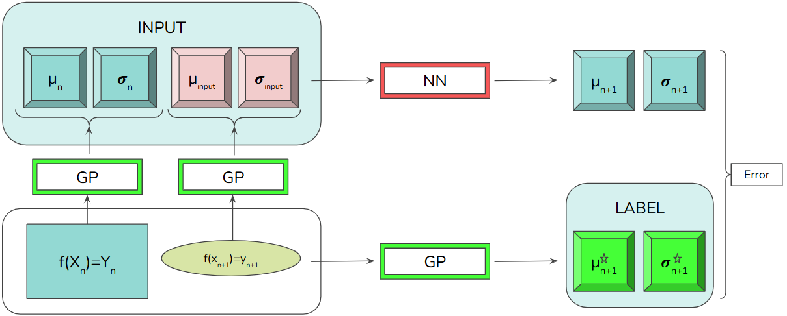

This works was done by Théodore DE LEUSSE as part of his internship in the SciNeurotechLab supervised by Marco BONIZZATO.
This internship took place from the September 3rd 2024 to February 17th 2025.

# NNonlineGP


## Objective

In this folder, our objective is to train neural networks that allow us to update the mean and uncertainty images based on these two images and two other images about the next query. Discover our strategy for training our neural networks in the following diagram.



The idea is to use the EMG maps to create data for training our models. We retrieve the data from the `.mat` files (data here: https://osf.io/54vhx/). You will need to download all these `.mat` files and place them in the folder at the path of NNonlineGP.

In `generate_dataset.ipynb`, we retrieve the data with the `DataSet` class, we transform the data to create datasets usable by our NNs with the `DataGen` class.

In `nn_training_and_results.ipynb`, here is what we do in each part of this notebook:
- A) We import the necessary libraries.
- B) We define the classes of our NNs.
- C) We define the training and evaluation functions.
- D) We retrieve the datasets created by `generate_dataset.ipynb`.
- E) We build the training/validation/test dataloaders, we use data augmentation from `DataAugmentation.py`, we define some hyperparameters (e.g., batch size).
- F) We train our NNs and save the weights in `.pth` files that we will store in `model\`.
- G) We recreate models using the weights saved in the `.pth` files from the `model\` folder.
- H) We perform postprocessing: we evaluate our NNs and create figures to evaluate and compare them.

In `MapVisualization.ipynb`, we visualize the original `.mat` maps (data here: https://osf.io/54vhx/) to better understand the data.


## Overview

This folder contains:
- 4 python files : `DataSet.py`, `DataGen.py`, `DataAugmentation.py` et `utilities.py`.
- 3 jupyter notebooks : `generate_dataset.ipynb`, `nn_training_and_results.ipynb` et `MapVisualization.ipynb`.
- 1 folder dataset wich stores lots of different `*.pth` and `*.pkl` datasets.
- 1 folder model that stores weigths of models in `*.pth` files.

The project is organized as follows:

``` bash
/📂NNonlineGP
|
├── 📄DataSet.py            # Contains the dataset class and methods for handling data from the `.mat` files ( data here : https://osf.io/54vhx/ )
├── 📄DataGen.py            # Responsible for generating synthetic data for training and testing our NN models.
├── 📄DataAugmentation.py   # Includes functions for augmenting the dataset to improve model robustness.
├── 📄utilities.py          # Utility functions used across the project.
├── 📄generate_dataset.ipynb  # Jupyter notebook for generating and visualizing datasets.
├── 📄nn_training_and_results.ipynb  # Jupyter notebook for training neural networks and displaying results.
├── 📄MapVisualization.ipynb  # Jupyter notebook for visualizing the original `.mat` datasets.
├── 📄README.md             # Project documentation and overview.
├── 📄LICENSE               # License information for the project.
|
├── 📂dataset/              # Stores all datasets
│   ├── 📂emgALLnhp/        # Contains training/validation/test datasets for all EMGs of one non human primate. (Cf. `generate_dataset.ipynb`)
│   ├── 📂emgALLrat/        # Contains training/validation/test datasets for all EMGs of one rat. (Cf. `generate_dataset.ipynb`)
│   ├── 📂emgCUSTOMnhp/     # Contains training/validation/test custom datasets for non-human primates. (Cf. `generate_dataset.ipynb`)
│   ├── 📂pkl_files/        # Pickle files for storing processed data. (Cf. DataGen class)
│   ├── 📂single_map/       # Single map data files. (Cf. DataGen class)
│   ├── 📂test_nhp/         # Test datasets for non-human primates. (Cf. `generate_dataset.ipynb`)
│   ├── 📂test_rat/         # Test datasets for rats. (Cf. `generate_dataset.ipynb`)
|
├── 📂model/                # Model storage
│   ├── 📂OLD_model/        # Archive of old models.
│   ├── 📄...               # models. (Cf. `nn_training_and_results.ipynb`)
```


## Installation

To install NNonlineGP, clone the repository.


